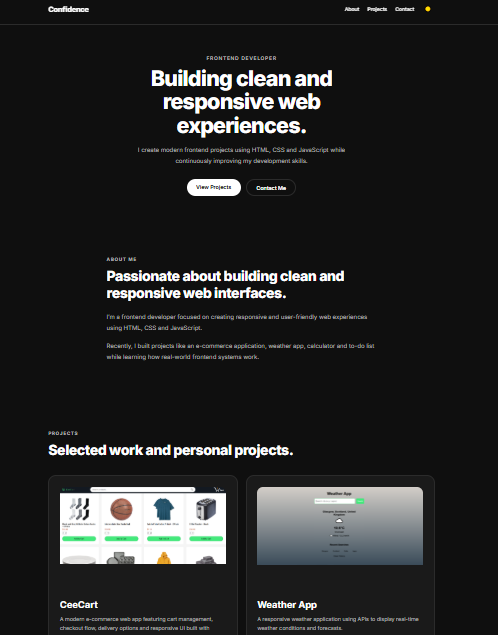

# 💼 Confidence – Frontend Developer Portfolio

A modern and responsive frontend developer portfolio built with HTML, CSS and JavaScript.

This portfolio showcases my projects, frontend skills and development journey while focusing on clean UI, responsiveness and smooth user experience.

---

## 🚀 Live Demo

🔗 https://your-vercel-link.vercel.app

---

## ✨ Features

- 🌙 Dark / Light mode toggle
- 📱 Fully responsive design
- 🍔 Mobile navigation menu
- 🎯 Active section navigation
- ✨ Scroll reveal animations
- 🖼️ Project showcase cards
- 🔗 Live demo & GitHub project links
- 📬 Contact section
- ⬆️ Smooth back-to-top navigation

---

## 🛠️ Built With

- HTML5
- CSS3
- JavaScript (Vanilla JS)

---

## 📂 Featured Projects

- 🛒 CeeCart – E-commerce Web App
- 🌦️ Weather App
- ✅ To-Do App
- 🧮 Calculator App

---

## 📚 What I Learned

- Structuring scalable frontend projects
- Building responsive layouts
- Creating reusable UI sections
- Managing theme persistence with localStorage
- Implementing scroll-based interactions
- Improving accessibility and UI polish
- Deploying frontend applications

---

## 📸 Screenshot

---

## 📬 Contact

- GitHub: https://github.com/Ceecee-ferdy
- Twitter/X: https://x.com/Ceecee_Chi

---

## ⭐ Acknowledgements

This project was built as part of my frontend development journey while improving my UI design, JavaScript and responsive design skills.